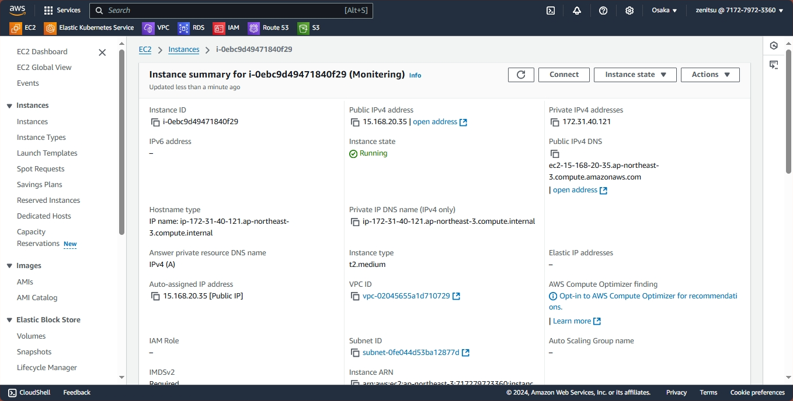

## EKS Monitering using Prometheus and Graffana

### Step 1: Create an ubuntu instance of instance type t2medium 



### Step 2:  install  AWS CLI using the below command


```
curl "https://awscli.amazonaws.com/awscli-exe-linux-x86_64.zip" -o "awscliv2.zip"
sudo apt-get update && sudo apt-get install -y unzip
unzip awscliv2.zip
sudo ./aws/install
aws --version
```

### Step 3: configure AWS Credentials so that it can authenticate and communicate with AWS Environment

```
aws configure
```

### Step 4: Install and setup kubectl

```
curl -LO "https://dl.k8s.io/release/v1.30.0/bin/linux/amd64/kubectl"
chmod +x ./kubectl
sudo mv ./kubectl /usr/local/bin/
kubectl version --client
```

### Step 5: Helm installation

```
curl -LO "https://get.helm.sh/helm-v3.10.2-linux-amd64.tar.gz"  # Replace with the latest version if available
tar -zxvf helm-v3.10.2-linux-amd64.tar.gz
sudo mv linux-amd64/helm /usr/local/bin/
helm version
```

### Step 6: configure the Amazon EKS cluster name eks2 using eksctl

```
eksctl create cluster --name eks2 --version 1.30 --region ap-northeast-3 --nodegroup-name worker-nodes --node-type t2.large --nodes 2 --nodes-min 2 --nodes-max 3 --zones ap-northeast-3a,ap-northeast-3b
```

### step 7:  Installing the Kubernetes Metrics Server

```
kubectl apply -f https://github.com/kubernetes-sigs/metrics-server/releases/latest/download/components.yaml
```

verify that the Metrics Server is running:

```
kubectl get pods -n kube-system
```

```
kubectl get deployment metrics-server -n kube-system
```

### Step 8: Install Prometheus

```
helm repo add prometheus-community https://prometheus-community.github.io/helm-charts
helm repo update
helm repo list
```

```
kubectl create namespace prometheus
```

```
helm install prometheus prometheus-community/prometheus \
    --namespace prometheus \
    --set alertmanager.persistentVolume.storageClass="gp2" \
    --set server.persistentVolume.storageClass="gp2"
```

### Step 9:  Create IAM OIDC (Open ID Connect) Provider

```
kubectl get all -n -prometheus
```

```
oidc_id=$(aws eks describe-cluster --name eks2 --query "cluster.identity.oidc.issuer" --output text | cut -d '/' -f 5)
aws iam list-open-id-connect-providers | grep $oidc_id | cut -d "/" -f4

eksctl utils associate-iam-oidc-provider --cluster eks2 --approve
```

```
eksctl create iamserviceaccount \
  --name ebs-csi-controller-sa \
  --namespace kube-system \
  --cluster eks2 \
  --attach-policy-arn arn:aws:iam::aws:policy/service-role/AmazonEBSCSIDriverPolicy \
  --approve \
  --role-only \
  --role-name AmazonEKS_EBS_CSI_DriverRole
```


```
eksctl create addon --name aws-ebs-csi-driver --cluster eks2 --service-account-role-arn arn:aws:iam::717279723360 :role/AmazonEKS_EBS_CSI_DriverRole --force
```

```
eksctl create addon --name aws-ebs-csi-driver --cluster eks2 --force
```

```
eksctl utils migrate-to-pod-identity --cluster eks2 --region <your-region> --cluster
```

```
kubectl get all -n -prometheus
```


Prometheus dashboard by forwarding the deployment ports


```
kubectl port-forward deployment/prometheus-server 9090:9090 -n prometheus
```

Open different browser and connect to your EC2 instance and run

```
curl localhost:9090/graph
```

### Step 10: Install Grafana

```
helm repo add grafana https://grafana.github.io/helm-charts
helm repo update
```

```
kubectl create namespace grafana
```


Create a yaml file prometheus-datasource.yamland save the following data source configuration into it

```
datasources:
  datasources.yaml:
    apiVersion: 1
    datasources:
    - name: Prometheus
      type: prometheus
      url: http://prometheus-server.prometheus.svc.cluster.local
      access: proxy
      isDefault: true
```


```
helm install grafana grafana/grafana \
    --namespace grafana \
    --set persistence.storageClassName="gp2" \
    --set persistence.enabled=true \
    --set adminPassword='admin' \
    --values prometheus-datasource.yaml \
    --set service.type=LoadBalancer
```

```
kubectl get all -n grafana
```

### Step 11: External IP address and open it in the browser 

### Step 12: Import Grafana Dashboard from Grafana Labs